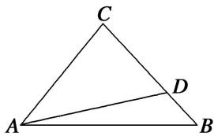

<!-- question-source:start -->
2. 如图, 在 $\triangle ABC$ 中, 点 $D$ 是 $BC$ 边上靠近 $B$ 的三等分点, 则 $\overrightarrow{AD}$ 等于( )

A. $\frac{2}{3}\overrightarrow{AB} -\frac{1}{3}\overrightarrow{AC}$ B. $\frac{1}{3}\overrightarrow{AB} +\frac{2}{3}\overrightarrow{AC}$ C. $\frac{2}{3}\overrightarrow{AB} +\frac{1}{3}\overrightarrow{AC}$ D. $\frac{1}{3}\overrightarrow{AB} -\frac{2}{3}\overrightarrow{AC}$

2.
<!-- question-source:end -->

![[高中/总复习/专题/平面向量/专题1 平面向量的线性运算-平面向量/考点一_向量的线性运算/对点训练/题目/answers/Q00033200A1.md]]
