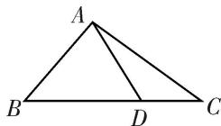

<!-- question-source:start -->
4. 如图所示，在 $\triangle ABC$ 中，若 $\overrightarrow{BC} = 3\overrightarrow{DC}$ ，则 $\overrightarrow{AD} = (\quad)$

A. $\frac{2}{3}\overrightarrow{AB} +\frac{1}{3}\overrightarrow{AC}$ B. $\frac{2}{3}\overrightarrow{AB} -\frac{1}{3}\overrightarrow{AC}$ C. $\frac{1}{3}\overrightarrow{AB} +\frac{2}{3}\overrightarrow{AC}$ D. $\frac{1}{3}\overrightarrow{AB} -\frac{2}{3}\overrightarrow{AC}$

4.
<!-- question-source:end -->

![[高中/总复习/专题/平面向量/专题1 平面向量的线性运算-平面向量/考点一_向量的线性运算/对点训练/题目/answers/Q00033202A1.md]]
