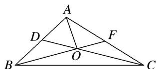

<!-- question-source:start -->
10. 如图所示, 在 $\triangle ABC$ 中, $D$ , $F$ 分别是 $AB$ , $AC$ 的中点, $BF$ 与 $CD$ 交于点 $O$ , 设 $\overrightarrow{AB} = a$ , $\overrightarrow{AC} = b$ , 则用 $a$ , $b$ 表示向量 $\overrightarrow{AO}$ 为 \_\_\_\_.

10.
<!-- question-source:end -->

![[高中/总复习/专题/平面向量/专题1 平面向量的线性运算-平面向量/考点一_向量的线性运算/对点训练/题目/answers/Q00033208A1.md]]
