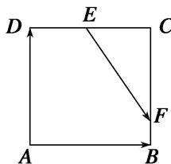

<!-- question-source:start -->
11. 如图，正方形 $ABCD$ 中，点 $E$ 是 $DC$ 的中点，点 $F$ 是 $BC$ 的一个三等分点，那么 $\overrightarrow{EF}$ 等于（ ）

A. $\frac{1}{2}\overrightarrow{AB} -\frac{1}{3}\overrightarrow{AD}$ B. $\frac{1}{4}\overrightarrow{AB} +\frac{1}{2}\overrightarrow{AD}$ C. $\frac{1}{3}\overrightarrow{AB} +\frac{1}{2}\overrightarrow{DA}$ D. $\frac{1}{2}\overrightarrow{AB} -\frac{2}{3}\overrightarrow{AD}$

11.
<!-- question-source:end -->

![[高中/总复习/专题/平面向量/专题1 平面向量的线性运算-平面向量/考点一_向量的线性运算/对点训练/题目/answers/Q00033209A1.md]]
