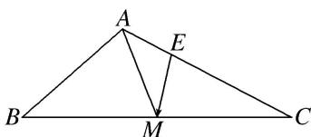

> [!faq]- 教师版对点训练解析
>
> > [!success]- **【答案】** C
>
> > [!note]- **【分析】**
> > 本题未单列分析。
>
> > [!note]- **【解析】**
> > 答案 C 解析 如图， $\because \overrightarrow{EC} = 2\overrightarrow{AE}$ ， $\therefore \overrightarrow{EM} = \overrightarrow{EC} + \overrightarrow{CM} = \frac{2}{3}\overrightarrow{AC} + \frac{1}{2}\overrightarrow{CB} = \frac{2}{3}\overrightarrow{AC} + \frac{1}{2} (\overrightarrow{AB} - \overrightarrow{AC}) = \frac{1}{2}\overrightarrow{AB} + \frac{1}{6}\overrightarrow{AC}$ .
> > 
