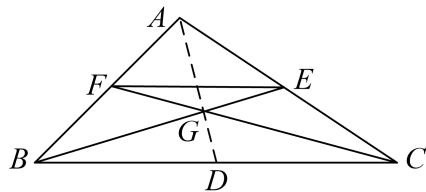

> [!faq]- 教师版对点训练解析
>
> > [!success]- **【答案】** CD
>
> > [!note]- **【分析】**
> > 本题未单列分析。
>
> > [!note]- **【解析】**
> > 答案 CD 解析 如图，因为点 D, E, F 分别是边 BC, CA, AB 的中点，所以 $\overrightarrow{EF} = \frac{1}{2}\overrightarrow{CB} = -\frac{1}{2}\overrightarrow{BC}$ ，故 A 不正确； $\overrightarrow{BE} = \overrightarrow{BC} + \overrightarrow{CE} = \overrightarrow{BC} + \frac{1}{2}\overrightarrow{CA} = \overrightarrow{BC} + \frac{1}{2} (\overrightarrow{CB} + \overrightarrow{BA}) = \overrightarrow{BC} - \frac{1}{2}\overrightarrow{BC} - \frac{1}{2}\overrightarrow{AB} = -\frac{1}{2}\overrightarrow{AB} + \frac{1}{2}\overrightarrow{BC}$ ，故 B 不正确； $\overrightarrow{FC} = \overrightarrow{AC} - \overrightarrow{AF} = \overrightarrow{AD} + \overrightarrow{DC} + \overrightarrow{FA} = \overrightarrow{AD} + \frac{1}{2}\overrightarrow{BC} + \overrightarrow{FA} = \overrightarrow{AD} + \overrightarrow{FE} + \overrightarrow{FA} = \overrightarrow{AD} + \overrightarrow{FB} + \overrightarrow{BE} + \overrightarrow{FA} = \overrightarrow{AD} + \overrightarrow{BE}$ ，故 C 正确；由题意知，点 G 为 $\triangle ABC$ 的重心，所以 $\overrightarrow{AG} + \overrightarrow{BG} + \overrightarrow{CG} = \frac{2}{3}\overrightarrow{AD} + \frac{2}{3}\overrightarrow{BE} + \frac{2}{3}\overrightarrow{CF} = \frac{2}{3} \times \frac{1}{2} (\overrightarrow{AB} + \overrightarrow{AC}) + \frac{2}{3} \times \frac{1}{2} (\overrightarrow{BA} + \overrightarrow{BC}) + \frac{2}{3} \times \frac{1}{2} (\overrightarrow{CB} + \overrightarrow{CA}) = 0$ ，即 $\overrightarrow{GA} + \overrightarrow{GB} + \overrightarrow{GC} = 0$ ，故 D 正确。故选 CD。
> > 
