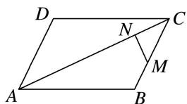

> [!faq]- 教师版对点训练解析
>
> > [!success]- **【答案】** 详见解析
>
> > [!note]- **【分析】**
> > 本题未单列分析。
>
> > [!note]- **【解析】**
> > 答案 $-\frac{2}{3}e_{1}+\frac{5}{12}e_{2}$ 解析 如图， $\overrightarrow{MN}=\overrightarrow{CN}-\overrightarrow{CM}=\overrightarrow{CN}+2\overrightarrow{BM}=\overrightarrow{CN}+\frac{2}{3}\overrightarrow{BC}=-\frac{1}{4}\overrightarrow{AC}+\frac{2}{3}(\overrightarrow{AC}-\overrightarrow{AB})=-\frac{1}{4}e_{2}+\frac{2}{3}(e_{2}-e_{1})=-\frac{2}{3}e_{1}+\frac{5}{12}e_{2}.$
> > 
