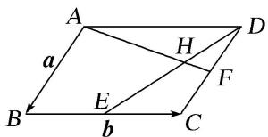

> [!faq]- 教师版对点训练解析
>
> > [!success]- **【答案】** B
>
> > [!note]- **【分析】**
> > 本题未单列分析。
>
> > [!note]- **【解析】**
> > 答案 B 解析 设 $\overrightarrow{AH} = \lambda \overrightarrow{AF}, \overrightarrow{DH} = \mu \overrightarrow{DE}$ . 而 $\overrightarrow{DH} = \overrightarrow{DA} + \overrightarrow{AH} = -b + \lambda \overrightarrow{AF} = -b + \lambda \left( b + \frac{1}{2} a \right)$ , $\overrightarrow{DH} = \mu \overrightarrow{DE} = \mu \left( a - \frac{1}{2} b \right)$ . 因此， $\mu \left( a - \frac{1}{2} b \right) = -b + \lambda \left( b + \frac{1}{2} a \right)$ . 由于 a, b 不共线，因此由平面向量的基本定理，得 $\left\{\begin{aligned}\mu &= \frac{1}{2}\lambda, \\-\frac{1}{2}\mu &= -1 + \lambda.\end{aligned}\right.$ 解之得 $\lambda = \frac{4}{5}, \mu = \frac{2}{5}$ . 故 $\overrightarrow{AH} = \lambda \overrightarrow{AF} = \lambda \left( b + \frac{1}{2} a \right) = \frac{2}{5} a + \frac{4}{5} b$ .
> > 
