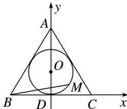

> [!faq]- 教师版例题解析
>
> > [!success]- **【答案】** C
>
> > [!note]- **【分析】**
> > 本题未单列分析。
>
> > [!note]- **【解析】**
> > 答案 C 解析 方法一 如图，连接 DA，以 D 点为原点，BC 所在直线为 x 轴，DA 所在直线为 y 轴，建立如图所示的平面直角坐标系．设内切圆的半径为 r，则圆心为坐标 $(0, r)$ ，
> > 
> > 根据三角形面积公式，得 $\frac{1}{2} \times l_{\triangle ABC} \times r = \frac{1}{2} \times AB \times AC \times \sin 60^\circ (l_{\triangle ABC}$ 为 $\triangle ABC$ 的周长)，解得 $r = 1$ 。易得 $B(-\sqrt{3}, 0)$ ， $C(\sqrt{3}, 0)$ ， $A(0, 3)$ ， $D(0, 0)$ ，设 $M(\cos \theta, 1 + \sin \theta)$ ， $\theta \in [0, 2\pi)$ ，则 $\overrightarrow{BM} = (\cos \theta + \sqrt{3}, 1 + \sin \theta)$ ， $\overrightarrow{BA} = (\sqrt{3}, 3)$ ， $\overrightarrow{BD} = (\sqrt{3}, 0)$ ，故 $\overrightarrow{BM} = (\cos \theta + \sqrt{3}, 1 + \sin \theta) = (\sqrt{3}x + \sqrt{3}y, 3x)$ ，故 $\left\{ \begin{array}{l} \cos \theta = \sqrt{3}x + \sqrt{3}y - \sqrt{3}, \\ \sin \theta = 3x - 1, \end{array} \right.$ 则 $\left\{ \begin{array}{l} x = \frac{1 + \sin \theta}{3}, \\ y = \frac{\sqrt{3}\cos \theta}{3} - \frac{\sin \theta}{3} + \frac{2}{3}, \end{array} \right.$ 所以 $2x + y = \frac{\sqrt{3}\cos \theta}{3} + \frac{\sin \theta}{3} + \frac{4}{3} = \frac{2}{3}\sin\left[\theta + \frac{\pi}{3}\right] + \frac{4}{3} \leq 2$ 。当 $\theta = \frac{\pi}{6}$ 时等号成立。故 $2x + y$ 的最大值为2。
> > 方法二 因为 $\overrightarrow{BM}=x\overrightarrow{BA}+y\overrightarrow{BD}$ ，所以 $|\overrightarrow{BM}|^{2}=3(4x^{2}+2xy+y^{2})=3[(2x+y)^{2}-2xy]$ 。由题意知， $x\geq0,\quad y\geq0$ ， $|\overrightarrow{BM}|$ 的最大值为 $\sqrt{(2\sqrt{3})^{2}-(\sqrt{3})^{2}}=3$ ，又 $\frac{(2x+y)^{2}}{4}\geq2xy$ ，即 $\frac{-(2x+y)^{2}}{4}\leq-2xy$ ，所以 $3\times\frac{3}{4}(2x+y)^{2}\leq9$ ，得 $2x+y\leq2$ ，当且仅当2x=y=1时取等号。
