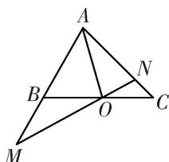

<!-- question-source:start -->
3. 如图所示, 在 $\triangle ABC$ 中, 点 $O$ 是 $BC$ 的中点, 过点 $O$ 的直线分别交直线 $AB$ , $AC$ 于不同的两点 $M$ , $N$ , 若 $\overrightarrow{AB} = m\overrightarrow{AM}$ , $\overrightarrow{AC} = n\overrightarrow{AN}$ , 则 $mn$ 的最大值为 \_\_\_\_.

3.
<!-- question-source:end -->

![[高中/总复习/专题/平面向量/专题1 平面向量的线性运算-平面向量/考点三_根据向量线性运算求参数的取值范围_最值_/对点训练/题目/answers/Q00033254A1.md]]
