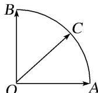

<!-- question-source:start -->
9. 给定两个长度为 1 的平面向量 $\overrightarrow{OA}$ 和 $\overrightarrow{OB}$ , 它们的夹角为 $90^{\circ}$ , 如图所示, 点 $C$ 在以 $O$ 为圆心的圆弧 $\widehat{AB}$ 上运动, 若 $\overrightarrow{OC} = x\overrightarrow{OA} + y\overrightarrow{OB}$ , 其中 $x, y \in \mathbf{R}$ , 则 $x + y$ 的最大值是( )

A. 1 B. $\sqrt{2}$ C. $\sqrt{3}$ D. 2

9.
<!-- question-source:end -->

![[高中/总复习/专题/平面向量/专题1 平面向量的线性运算-平面向量/考点三_根据向量线性运算求参数的取值范围_最值_/对点训练/题目/answers/Q00033260A1.md]]
