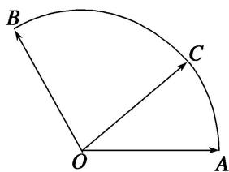

<!-- question-source:start -->
10. 给定两个长度为 1 的平面向量 $\overrightarrow{OA}$ 和 $\overrightarrow{OB}$ ，它们的夹角为 $\frac{2\pi}{3}$ 。如图所示，点 $C$ 在以 $O$ 为圆心的圆弧 $\widehat{AB}$ 上运动。若 $\overrightarrow{OC} = x\overrightarrow{OA} + y\overrightarrow{OB}$ ，其中 $x, y \in \mathbf{R}$ ，则 $x + y$ 的最大值为 \_\_\_\_.

10.
<!-- question-source:end -->

![[高中/总复习/专题/平面向量/专题1 平面向量的线性运算-平面向量/考点三_根据向量线性运算求参数的取值范围_最值_/对点训练/题目/answers/Q00033261A1.md]]
