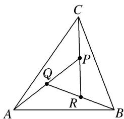

<!-- question-source:start -->
(6)如图，在 $\triangle ABC$ 中，设 $\overrightarrow{AB}=\boldsymbol{a}$ ， $\overrightarrow{AC}=\boldsymbol{b}$ ， $AP$ 的中点为 $Q$ ， $BQ$ 的中点为 $R$ ， $CR$ 的中点为 $P$ ，若 $\overrightarrow{AP}=ma+nb$ ，则 $m+n=$ \_\_\_\_.

<!-- question-source:end -->

![[高中/总复习/专题/平面向量/专题1 平面向量的线性运算-平面向量/考点二_根据向量线性运算求参数/例题选讲/例题/answers/Q00033220A1.md]]
