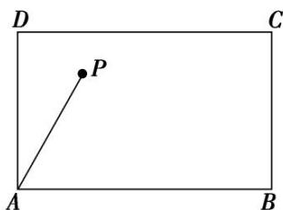

<!-- question-source:start -->
(7)如图所示，点 $P$ 在矩形ABCD内，且满足 $\angle DAP = 30^{\circ}$ ，若 $|\overrightarrow{AD}| = 1$ ， $|\overrightarrow{AB}| = \sqrt{3}$ ， $\overrightarrow{AP} = m\overrightarrow{AD} + n\overrightarrow{AB}(m, n \in \mathbf{R})$ ，则 $\frac{m}{n}$ 等于（）

A. $\frac{1}{3}$ B. 3 C. $\frac{\sqrt{3}}{3}$ D. $\sqrt{3}$
<!-- question-source:end -->

![[高中/总复习/专题/平面向量/专题1 平面向量的线性运算-平面向量/考点二_根据向量线性运算求参数/例题选讲/例题/answers/Q00033221A1.md]]
