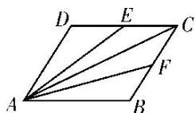

<!-- question-source:start -->
(8)在平行四边形 ABCD 中，点 E 和 F 分别是边 CD 和 BC 的中点．若 $\overrightarrow{AC} = \lambda \overrightarrow{AE} + \mu \overrightarrow{AF}$ ，其中 $\lambda, \mu \in R$ ，则 $\lambda + \mu =$ \_\_\_\_ .

<!-- question-source:end -->

![[高中/总复习/专题/平面向量/专题1 平面向量的线性运算-平面向量/考点二_根据向量线性运算求参数/例题选讲/例题/answers/Q00033222A1.md]]
