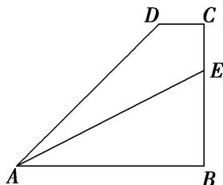

<!-- question-source:start -->
(9)如图，在直角梯形ABCD中， $\overrightarrow{DC} = \frac{1}{4}\overrightarrow{AB}$ ， $\overrightarrow{BE} = 2\overrightarrow{EC}$ ，且 $\overrightarrow{AE} = r\overrightarrow{AB} + s\overrightarrow{AD}$ ，则 $2r + 3s = (\quad)$

A. 1 B. 2 C. 3 D. 4
<!-- question-source:end -->

![[高中/总复习/专题/平面向量/专题1 平面向量的线性运算-平面向量/考点二_根据向量线性运算求参数/例题选讲/例题/answers/Q00033223A1.md]]
