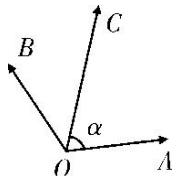

<!-- question-source:start -->
(10)(2017·江苏)如图, 在同一个平面内, 向量 $\overrightarrow{OA}, \overrightarrow{OB}$ , $\overrightarrow{OC}$ 的模分别为 1, 1, $\sqrt{2}$ , $\overrightarrow{OA}$ 与 $\overrightarrow{OC}$ 的夹角为 $\alpha$ , 且 $\tan \alpha = 7$ , $\overrightarrow{OB}$ 与 $\overrightarrow{OC}$ 的夹角为 $45^{\circ}$ . 若 $\overrightarrow{OC} = m\overrightarrow{OA} + n\overrightarrow{OB}(m, n \in \mathbf{R})$ , 则 $m + n =$ \_\_\_\_.

<!-- question-source:end -->

![[高中/总复习/专题/平面向量/专题1 平面向量的线性运算-平面向量/考点二_根据向量线性运算求参数/例题选讲/例题/answers/Q00033224A1.md]]
