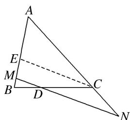

> [!faq]- 教师版例题解析
>
> > [!success]- **【答案】** D
>
> > [!note]- **【分析】**
> > 本题未单列分析。
>
> > [!note]- **【解析】**
> > 答案 D 解析 法一：如图，过点 C 作 CE 平行于 MN 交 AB 于点 E．由 $\overrightarrow{AN}=n\overrightarrow{AC}$ 可得 $\frac{AC}{AN}=\frac{1}{n}$ ，所以 $\frac{AE}{EM}=\frac{AC}{CN}=\frac{1}{n-1}$ ，由 $BD=\frac{1}{2}DC$ 可得 $\frac{BM}{ME}=\frac{1}{2}$ ，所以 $\frac{AM}{AB}=\frac{n}{n+\frac{n-1}{2}}=\frac{2n}{3n-1}$ ，因为 $\overrightarrow{AM}=m\overrightarrow{AB}$ ，所以 $m=\frac{2n}{3n-1}$ ，整理可得 $\frac{2}{m}+\frac{1}{n}=3$ ．故选 D.
> > 
> > 法二：因为 M, D, N 三点共线，所以 $\overrightarrow{AD} = \lambda \overrightarrow{AM} + (1 - \lambda) \cdot \overrightarrow{AN}$ . 又 $\overrightarrow{AM} = m \overrightarrow{AB}$ , $\overrightarrow{AN} = n \overrightarrow{AC}$ ，所以 $\overrightarrow{AD} = \lambda m \overrightarrow{AB} + (1 - \lambda) \cdot n \overrightarrow{AC}$ . 又 $\overrightarrow{BD} = \frac{1}{2} \overrightarrow{DC}$ ，所以 $\overrightarrow{AD} - \overrightarrow{AB} = \frac{1}{2} \overrightarrow{AC} - \frac{1}{2} \overrightarrow{AD}$ ，所以 $\overrightarrow{AD} = \frac{1}{3} \overrightarrow{AC} + \frac{2}{3} \overrightarrow{AB}$ . 比较系数知 $\lambda m = \frac{2}{3}$ , $(1 - \lambda)n = \frac{1}{3}$ ，所以 $\frac{2}{m} + \frac{1}{n} = 3$ ，
> >
> > 故选 **D**.
