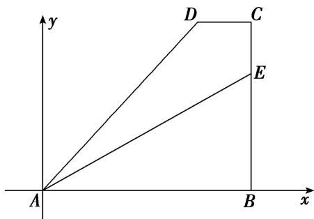

> [!faq]- 教师版例题解析
>
> > [!success]- **【答案】** C
>
> > [!note]- **【分析】**
> > 本题未单列分析。
>
> > [!note]- **【解析】**
> > 答案 C 解析 根据图形，由题意可得 $\overrightarrow{AE} = \overrightarrow{AB} + \overrightarrow{BE} = \overrightarrow{AB} + \frac{2}{3}\overrightarrow{BC} = \overrightarrow{AB} + \frac{2}{3} (\overrightarrow{BA} + \overrightarrow{AD} + \overrightarrow{DC}) = \frac{1}{3}\overrightarrow{AB} + \frac{2}{3} (\overrightarrow{AD} + \overrightarrow{DC}) = \frac{1}{3}\overrightarrow{AB} + \frac{2}{3}\left(\overrightarrow{AD} + \frac{1}{4}\overrightarrow{AB}\right) = \frac{1}{2}\overrightarrow{AB} + \frac{2}{3}\overrightarrow{AD}$ . 因为 $\overrightarrow{AE} = r\overrightarrow{AB} + s\overrightarrow{AD}$ ，所以 $r = \frac{1}{2}, s = \frac{2}{3}$ ，则 $2r + 3s = 1 + 2 = 3$ ，故选 C.
> > 优解：如图，建立平面直角坐标系 $xAy$ ，依题意可设点 $B(4m,0)$ ， $D(3m,3h)$ ， $\mathrm{E}(4m,2h)$ ，其中 $m>$ 0， $h > 0$
> > 
> > 由 $\overrightarrow{AE}=r\overrightarrow{AB}+s\overrightarrow{AD}$ ，得(4m, 2h)=r(4m, 0)+s(3m, 3h)，∴ $\left\{\begin{aligned}&4m=4mr+3ms\\ &2h=3hs\end{aligned}\right.$ ，解得 $\left\{\begin{aligned}&r=\frac{1}{2},\\ &s=\frac{2}{3}.\end{aligned}\right.$ $\therefore2r+3s=3$ .
