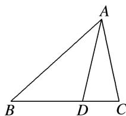

<!-- question-source:start -->
2. 如图所示，在 $\triangle ABC$ 中， $D$ 为 $BC$ 边上的一点，且 $BD = 2DC$ ，若 $\overrightarrow{AC} = m\overrightarrow{AB} + n\overrightarrow{AD}(m, n \in \mathbf{R})$ ，则 $m - n =$ \_\_\_\_.

2.
<!-- question-source:end -->

![[高中/总复习/专题/平面向量/专题1 平面向量的线性运算-平面向量/考点二_根据向量线性运算求参数/对点训练/题目/answers/Q00033226A1.md]]
