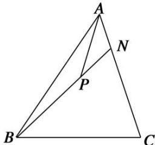

<!-- question-source:start -->
9. 如图, 在 $\triangle ABC$ 中, $\overrightarrow{AN} = \frac{1}{3}\overrightarrow{NC}$ , $P$ 是 $BN$ 上的一点, 若 $\overrightarrow{AP} = m\overrightarrow{AB} + \frac{2}{11}\overrightarrow{AC}$ , 则实数 $m$ 的值为 \_\_\_\_.

9.
<!-- question-source:end -->

![[高中/总复习/专题/平面向量/专题1 平面向量的线性运算-平面向量/考点二_根据向量线性运算求参数/对点训练/题目/answers/Q00033233A1.md]]
