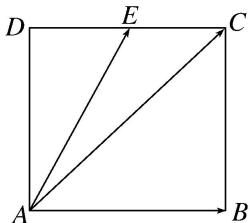

<!-- question-source:start -->
14. 如图，正方形 $ABCD$ 中， $E$ 为 $DC$ 的中点，若 $\overrightarrow{AE} = \lambda \overrightarrow{AB} + \mu \overrightarrow{AC}$ ，则 $\lambda + \mu$ 的值为（）

A. $\frac{1}{2}$ B. $-\frac{1}{2}$ C. 1 D. -1

14.
<!-- question-source:end -->

![[高中/总复习/专题/平面向量/专题1 平面向量的线性运算-平面向量/考点二_根据向量线性运算求参数/对点训练/题目/answers/Q00033238A1.md]]
