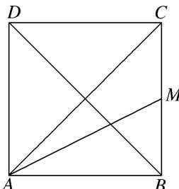

<!-- question-source:start -->
15. 如图所示，正方形 $ABCD$ 中， $M$ 是 $BC$ 的中点，若 $\overrightarrow{AC} = \lambda \overrightarrow{AM} + \mu \overrightarrow{BD}$ ，则 $\lambda + \mu = (\quad)$

A. $\frac{4}{3}$ B. $\frac{5}{3}$ C. $\frac{15}{8}$ D. 2

15.
<!-- question-source:end -->

![[高中/总复习/专题/平面向量/专题1 平面向量的线性运算-平面向量/考点二_根据向量线性运算求参数/对点训练/题目/answers/Q00033239A1.md]]
