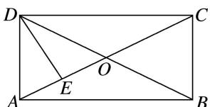

<!-- question-source:start -->
16. 如图所示, 矩形 $ABCD$ 的对角线相交于点 $O$ , $E$ 为 $AO$ 的中点, 若 $\overrightarrow{DE} = \lambda \overrightarrow{AB} + \mu \overrightarrow{AD} (\lambda, \mu$ 为实数), 则 $\lambda^2 + \mu^2$ 等于 ( )

A. $\frac{5}{8}$ B. $\frac{1}{4}$ C. 1 D. $\frac{5}{16}$

16.
<!-- question-source:end -->

![[高中/总复习/专题/平面向量/专题1 平面向量的线性运算-平面向量/考点二_根据向量线性运算求参数/对点训练/题目/answers/Q00033240A1.md]]
