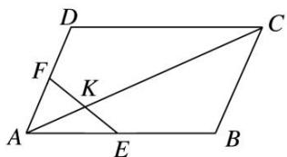

<!-- question-source:start -->
17. 如图, 直线 $EF$ 与平行四边形 $ABCD$ 的两边 $AB$ , $AD$ 分别交于 $E$ , $F$ 两点, 且与对角线 $AC$ 交于点 $K$ , 其中, $\overrightarrow{AE} = \frac{2}{5}\overrightarrow{AB}$ , $\overrightarrow{AF} = \frac{1}{2}\overrightarrow{AD}$ , $\overrightarrow{AK} = \lambda \overrightarrow{AC}$ , 则 $\lambda$ 的值为 \_\_\_\_.

17.
<!-- question-source:end -->

![[高中/总复习/专题/平面向量/专题1 平面向量的线性运算-平面向量/考点二_根据向量线性运算求参数/对点训练/题目/answers/Q00033241A1.md]]
