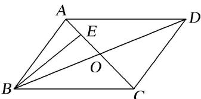

<!-- question-source:start -->
18. 如图，在平行四边形 $ABCD$ 中， $AC, BD$ 相交于点 $O, E$ 为线段 $AO$ 的中点．若 $\overrightarrow{BE} = \lambda \overrightarrow{BA} + \mu \overrightarrow{BD} (\lambda, \mu \in \mathbf{R})$ ，则 $\lambda + \mu$ 等于（）

A. 1 B. $\frac{3}{4}$ C. $\frac{2}{3}$ D. $\frac{1}{2}$

18.
<!-- question-source:end -->

![[高中/总复习/专题/平面向量/专题1 平面向量的线性运算-平面向量/考点二_根据向量线性运算求参数/对点训练/题目/answers/Q00033242A1.md]]
