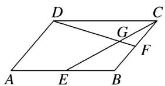

<!-- question-source:start -->
20. 如图，在平行四边形 $ABCD$ 中， $E, F$ 分别为边 $AB, BC$ 的中点，连接 $CE, DF$ ，交于点 $G$ 。若 $\overrightarrow{CG} = \lambda \overrightarrow{CD}$

$+\mu\overrightarrow{CB}(\lambda,\ \mu\in\mathbf{R})$ ，则 $\frac{\lambda}{\mu}=$ \_\_\_\_.

20.
<!-- question-source:end -->

![[高中/总复习/专题/平面向量/专题1 平面向量的线性运算-平面向量/考点二_根据向量线性运算求参数/对点训练/题目/answers/Q00033244A1.md]]
