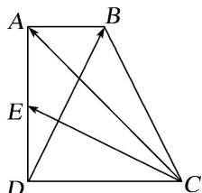

<!-- question-source:start -->
21. 如图，在直角梯形 $ABCD$ 中， $AB \parallel DC$ ， $AD \perp DC$ ， $AD = DC = 2AB$ ， $E$ 为 $AD$ 的中点，若 $\overrightarrow{CA} = \lambda \overrightarrow{CE} + \mu \overrightarrow{DB} (\lambda, \mu \in \mathbf{R})$ ，则 $\lambda + \mu$ 的值为（）

A. $\frac{6}{5}$ B. $\frac{8}{5}$ C. 2 D. $\frac{8}{3}$

21.
<!-- question-source:end -->

![[高中/总复习/专题/平面向量/专题1 平面向量的线性运算-平面向量/考点二_根据向量线性运算求参数/对点训练/题目/answers/Q00033245A1.md]]
