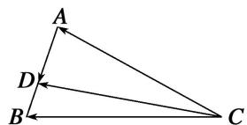

> [!faq]- 教师版对点训练解析
>
> > [!success]- **【答案】** 详见解析
>
> > [!note]- **【分析】**
> > 本题未单列分析。
>
> > [!note]- **【解析】**
> > 答案 $\frac{2}{3}$ 解析 由图知 $\overrightarrow{CD} = \overrightarrow{CA} + \overrightarrow{AD}$ ，①。 $\overrightarrow{CD} = \overrightarrow{CB} + \overrightarrow{BD}$ ，②。且 $\overrightarrow{AD} + 2\overrightarrow{BD} = 0$ 。
> > - **①**：+②×2得： $3\overrightarrow{CD} = \overrightarrow{CA} + 2\overrightarrow{CB}$ ， $\therefore \overrightarrow{CD} = \frac{1}{3}\overrightarrow{CA} + \frac{2}{3}\overrightarrow{CB}$ ， $\therefore \lambda = \frac{2}{3}$ 。
> > 
