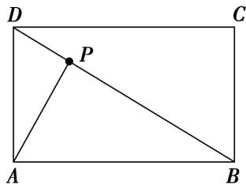

> [!faq]- 教师版对点训练解析
>
> > [!success]- **【答案】** A
>
> > [!note]- **【分析】**
> > 本题未单列分析。
>
> > [!note]- **【解析】**
> > 答案 A 解析 $\overrightarrow{DE} = \frac{1}{2}\overrightarrow{DA} +\frac{1}{2}\overrightarrow{DO} = \frac{1}{2}\overrightarrow{DA} +\frac{1}{4}\overrightarrow{DB} = \frac{1}{2}\overrightarrow{DA} +\frac{1}{4} (\overrightarrow{DA} +\overrightarrow{AB}) = \frac{1}{4}\overrightarrow{AB} -\frac{3}{4}\overrightarrow{AD}$ ，所以 $\lambda = \frac{1}{4},\mu = -\frac{3}{4},$ 故 $\lambda^2 +\mu^2 = \frac{5}{8}$ ，故选A.
> > 
