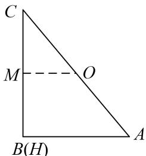

> [!faq]- 《专题10 平面向量与三角形的4心-平面向量》例题解析
>
> > [!success]- **【答案】** D
>
> > [!note]- **【解析】**
> > 答案 D 解析 如图所示的 RtΔABC，其中角 B 为直角，则垂心 H 与 B 重合，∵ O 为 ΔABC 的外心，∴ OA = OC，即 O 为斜边 AC 的中点，又 ∵ M 为 BC 中点，∴ $\overrightarrow{AH} = 2\overrightarrow{OM}$ ，∵ M 为 BC 中点，∴ $\overrightarrow{AB} + \overrightarrow{AC} = 2\overrightarrow{AM} = 2(\overrightarrow{AH} + \overrightarrow{HM}) = 2(2\overrightarrow{OM} + \overrightarrow{HM}) = 4\overrightarrow{OM} + 2\overrightarrow{HM} = 2\overrightarrow{HM} - 4\overrightarrow{MO}$ 。故选 D.
> >
> > 
> >
> > ## 【对点训练】
