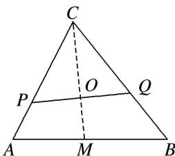

> [!faq]- 《专题10 平面向量与三角形的4心-平面向量》例题解析
>
> > [!success]- **【答案】** 详见解析
>
> > [!note]- **【分析】**
> > 本题未单列分析。
>
> > [!note]- **【解析】**
> > 答案 $\frac{3}{5}$ 解析 因为 $O$ 是重心，所以 $\overrightarrow{OA} + \overrightarrow{OB} + \overrightarrow{OC} = 0$ ，即 $\overrightarrow{OA} = -\overrightarrow{OB} - \overrightarrow{OC}$ ， $\overrightarrow{PC} = \frac{3}{4}\overrightarrow{AC} \Rightarrow \overrightarrow{OC} - \overrightarrow{OP} = \frac{3}{4}$ $(\overrightarrow{OC} - \overrightarrow{OA}) \Rightarrow \overrightarrow{OP} = \frac{3}{4}\overrightarrow{OA} + \frac{1}{4}\overrightarrow{OC} = -\frac{3}{4}\overrightarrow{OB} - \frac{1}{2}\overrightarrow{OC}, \quad \overrightarrow{QC} = n\overrightarrow{BC} \Rightarrow \overrightarrow{OC} - \overrightarrow{OQ} = n(\overrightarrow{OC} - \overrightarrow{OB}) \Rightarrow \overrightarrow{OQ} = n\overrightarrow{OB} + (1 - n)$ $\overrightarrow{OC}$ ，因为 $P, O, Q$ 三点共线，所以 $\overrightarrow{OP} // \overrightarrow{OQ}$ ，所以 $-\frac{3}{4}(1 - n) = -\frac{1}{2}n$ ，解得 $n = \frac{3}{5}$ .
> > 
