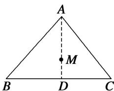

> [!faq]- 《专题10 平面向量与三角形的4心-平面向量》例题解析
>
> > [!success]- **【答案】** B
>
> > [!note]- **【分析】**
> > 本题未单列分析。
>
> > [!note]- **【解析】**
> > 答案 B 解析 $\because \overrightarrow{MA} + \overrightarrow{MB} + \overrightarrow{MC} = 0, \therefore M$ 为 $\triangle ABC$ 的重心．连接 $AM$ 并延长交 $BC$ 于 $D$ ，则 $D$ 为 $BC$ 的中点． $\therefore \overrightarrow{AM} = \frac{2}{3}\overrightarrow{AD}$ ．又 $\overrightarrow{AD} = \frac{1}{2} (\overrightarrow{AB} + \overrightarrow{AC})$ ， $\therefore \overrightarrow{AM} = \frac{1}{3} (\overrightarrow{AB} + \overrightarrow{AC})$ ，即 $\overrightarrow{AB} + \overrightarrow{AC} = 3\overrightarrow{AM}$ ， $\therefore m = 3$ ，故选 B.
> > 
