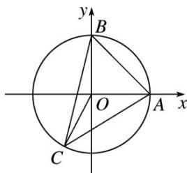

> [!faq]- 《专题10 平面向量与三角形的4心-平面向量》例题解析
>
> > [!success]- **【答案】** B
>
> > [!note]- **【解析】**
> > 答案 B 解析 由题意 $\angle C = 45^{\circ}$ , 所以 $\angle AOB = 90^{\circ}$ , 以 $OA$ , $OB$ 为 $x$ , $y$ 轴建立平面直角坐标系, 如图, 不妨设 $A(1,0)$ , $B(0,1)$ , 则 $C$ 在圆 $O$ 的优弧 $AB$ 上, 设 $C(\cos \alpha, \sin \alpha)$ , 则 $\alpha \in \left(\frac{\pi}{2}, 2\pi\right)$ , 显然 $\overrightarrow{OC} = \cos \alpha \overrightarrow{OA} + \sin \alpha \overrightarrow{OB}$ ,
> >
> > 
> >
> > 即 $m=\cos\alpha,\quad n=\sin\alpha,\quad m+n=\cos\alpha+\sin\alpha=\sqrt{2}\sin\left(\alpha+\frac{\pi}{4}\right)$ ，由于 $\alpha\in\left(\frac{\pi}{2},\quad2\pi\right)$ ，所以 $\alpha+\frac{\pi}{4}\in\left(\frac{3\pi}{4},\quad\frac{9\pi}{4}\right)$ ， $\sin\left(\alpha+\frac{\pi}{4}\right)\in\left[-1,\quad\frac{\sqrt{2}}{2}\right]$ ，所以 $m+n\in[-\sqrt{2},1)$ ，
> >
> > 故选 **B**.
