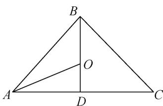

> [!faq]- 教师版例题解析
>
> > [!success]- **【答案】** 详见解析
>
> > [!note]- **【分析】**
> > 本题未单列分析。
>
> > [!note]- **【解析】**
> > 答案 内心 解析 由条件，得 $\overrightarrow{OP} -\overrightarrow{OA} = \lambda \left(\frac{\overrightarrow{AB}}{|\overrightarrow{AB}|} +\frac{\overrightarrow{AC}}{|\overrightarrow{AC}|}\right)$ 即 $\overrightarrow{AP} = \lambda \left(\frac{\overrightarrow{AB}}{|\overrightarrow{AB}|} +\frac{\overrightarrow{AC}}{|\overrightarrow{AC}|}\right)$ 而 $\frac{\overrightarrow{AB}}{|\overrightarrow{AB}|}$ 和 $\frac{\overrightarrow{AC}}{|\overrightarrow{AC}|}$ 分别表示平行于 $\overrightarrow{AB}$ ， $\overrightarrow{AC}$ 的单位向量，故 $\frac{\overrightarrow{AB}}{|\overrightarrow{AB}|} +\frac{\overrightarrow{AC}}{|\overrightarrow{AC}|}$ 平分∠BAC，即 $\overrightarrow{AP}$ 平分∠BAC，所以点 $P$ 的轨迹必过△ABC的内心.
> > 
