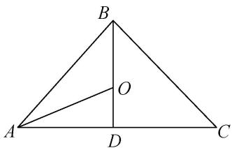

> [!faq]- 教师版例题解析
>
> > [!success]- **【答案】** 详见解析
>
> > [!note]- **【分析】**
> > 本题未单列分析。
>
> > [!note]- **【解析】**
> > 答案 $\frac{3}{2}$ 解析 如图， $O$ 为 $\triangle ABC$ 的内心， $D$ 为 $AC$ 中点，则 $O$ 在线段 $BD$ 上， $\cos\angle DAO=\frac{\frac{1}{2}|\overrightarrow{AC}|}{|\overrightarrow{AO}|}=\frac{3}{2|\overrightarrow{AO}|}$ ，根据余弦定理 $\cos\angle BAC=\frac{4+9-4}{2\times2\times3}=\frac{3}{4}$ ；由 $\overrightarrow{AO}=p\overrightarrow{AB}+q\overrightarrow{AC}$ 得 $\overrightarrow{AO}\cdot\overrightarrow{AB}=p\overrightarrow{AB}^{2}+q\overrightarrow{AB}\cdot\overrightarrow{AC}$ ，所以 $|AO,\vec{\rightarrow}||AB,\vec{\rightarrow}|\cos\angle BAO=p\overrightarrow{AB}^{2}+q|\overrightarrow{AB}||\overrightarrow{AC}|\cos\angle BAC$ ，所以 $3=4p+\frac{9}{2}q$ ①；同理 $\overrightarrow{AO}\cdot\overrightarrow{AC}=p\overrightarrow{AB}\cdot\overrightarrow{AC}+q\overrightarrow{AC}^{2}$ ，所以可以得到 $\frac{9}{2}=\frac{9}{2}p+9q$ ②．①②联立可求得 $p=\frac{3}{7}$ ， $q=\frac{2}{7}$ ，所以 $\frac{p}{q}=\frac{3}{2}$ .
> > 
