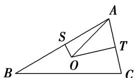

<!-- question-source:start -->
10. 已知 $O$ 是 $\triangle ABC$ 的外心， $|\overrightarrow{AB}| = 4$ ， $|\overrightarrow{AC}| = 2$ ，则 $\overrightarrow{AO} \cdot (\overrightarrow{AB} + \overrightarrow{AC}) = (\quad)$

A. 10 B. 9 C. 8 D. 6

10.
<!-- question-source:end -->

![[高中/总复习/专题/平面向量/专题10 平面向量与三角形的4心-平面向量/考点二_三角形四心的应用/对点训练/题目/answers/Q00033503A1.md]]
