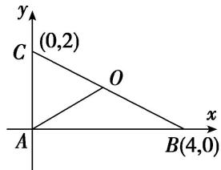

> [!faq]- 教师版对点训练解析
>
> > [!success]- **【答案】** A
>
> > [!note]- **【分析】**
> > 本题未单列分析。
>
> > [!note]- **【解析】**
> > 答案 A 解析 作 $OS \perp AB, OT \perp AC \because O$ 为 $\triangle ABC$ 的外接圆圆心. $\therefore S, T$ 为 $AB, AC$ 的中点, 且 $\overrightarrow{AS} \cdot \overrightarrow{SO}$ $= 0$ , $\overrightarrow{AT} \cdot \overrightarrow{TO} = 0$ , $\overrightarrow{AO} = \overrightarrow{AS} + \overrightarrow{SO}, \overrightarrow{AO} = \overrightarrow{AT} + \overrightarrow{TO}$ , $\therefore \overrightarrow{AO} \cdot (\overrightarrow{AB} + \overrightarrow{AC}) = \overrightarrow{AO} \cdot \overrightarrow{AB} + \overrightarrow{AO} \cdot \overrightarrow{AC} = (\overrightarrow{AS} + \overrightarrow{SO}) \cdot \overrightarrow{AB} + (\overrightarrow{AT} + \overrightarrow{TO}) \cdot \overrightarrow{AC} = \overrightarrow{AS} \cdot \overrightarrow{AB} + \overrightarrow{SO} \cdot \overrightarrow{AB} + \overrightarrow{AT} \cdot \overrightarrow{AC} + \overrightarrow{TO} \cdot \overrightarrow{AC} = \frac{1}{2} \overrightarrow{AB} \cdot \overrightarrow{AB} + \frac{1}{2} \overrightarrow{AC} \cdot \overrightarrow{AC} = \frac{1}{2} |\overrightarrow{AB}|^2 + \frac{1}{2} |\overrightarrow{AC}|^2 = 8 + 2 = 10$ . 故选 A. 优解: 不妨设 $\angle A = 90^\circ$ , 建立如图所示平面直角坐标系. 设 $B(4, 0)$ , $C(0, 2)$ , 则 $O$ 为 $BC$ 的中点 $O(2, 1)$ , $\therefore \overrightarrow{AB} + \overrightarrow{AC} = 2\overrightarrow{AO}$ , $\therefore \overrightarrow{AO} \cdot (\overrightarrow{AB} + \overrightarrow{AC}) = 2|\overrightarrow{AO}|^2 = 2(4 + 1) = 10$ . 故选 A.
> > 
