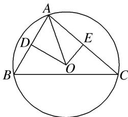

> [!faq]- 教师版对点训练解析
>
> > [!success]- **【答案】** D
>
> > [!note]- **【分析】**
> > 本题未单列分析。
>
> > [!note]- **【解析】**
> > 解析：选 D 如图，分别取 AB, AC 的中点，为 D, E，并连接 OD, OE，根据条件有 $OD \perp AB$ , OE
> > $\perp AC, \therefore \overrightarrow{AO} \cdot \overrightarrow{AB} = \frac{1}{2} |\overrightarrow{AB}|^2 = \frac{9}{2}, \overrightarrow{AO} \cdot \overrightarrow{AC} = \frac{1}{2} |\overrightarrow{AC}|^2 = 6,$
> > 
> > $\therefore \overrightarrow{AO} \cdot \overrightarrow{AB} = (x\overrightarrow{AB} + y\overrightarrow{AC}) \cdot \overrightarrow{AB} = 9x + 6\sqrt{3}y \cdot \cos \angle BAC = \frac{9}{2}$ , ①, $\overrightarrow{AO} \cdot \overrightarrow{AC} = (x\overrightarrow{AB} + y\overrightarrow{AC}) \cdot \overrightarrow{AC} = 6\sqrt{3}x \cos \angle BAC + 12y = 6$ , ②, 又 $9x + 12y = 8$ , ③, $\therefore$ 由①②③解得 $\cos \angle BAC = \frac{3\sqrt{3} - \sqrt{7}}{8}$ . 由余弦定理得, $BC = \sqrt{9 + 12 - 2 \times 3 \times 2\sqrt{3} \times \frac{3\sqrt{3} - \sqrt{7}}{8}} = \sqrt{\frac{15 + 3\sqrt{21}}{2}}$ . $\therefore BC > AC > AB$ . 在△ABC中, 由大边对大角得, $\angle BAC > \angle ABC > \angle ACB$ , $\therefore \angle BOC > \angle AOC > \angle AOB$ , $\because |\overrightarrow{OA}| = |\overrightarrow{OB}| = |\overrightarrow{OC}|$ , 且余弦函数在(0, π)上为减函数, $\therefore \overrightarrow{OB} \cdot \overrightarrow{OC} < \overrightarrow{OA} \cdot \overrightarrow{OC} < \overrightarrow{OA} \cdot \overrightarrow{OB}$ , 即 $I_2 < I_3 < I_1$ .
