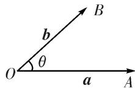

# 专题二 平面向量的数量积

## 1. 向量的夹角

(1)定义：已知两个非零向量 a 和 b，作 $\overrightarrow{OA}=a,\quad\overrightarrow{OB}=b$ ，则 $\angle AOB$ 就是向量 a 与 b 的夹角.

(2)范围：设 $\theta$ 是向量 $\pmb{a}$ 与 $\pmb{b}$ 的夹角，则 $0^{\circ} \leq \theta \leq 180^{\circ}$ .

(3)共线与垂直：若 $\theta = 0^{\circ}$ ，则 $\pmb{a}$ 与 $\pmb{b}$ 同向；若 $\theta = 180^{\circ}$ ，则 $\pmb{a}$ 与 $\pmb{b}$ 反向；若 $\theta = 90^{\circ}$ ，则 $\pmb{a}$ 与 $\pmb{b}$ 垂直.

## 2. 平面向量的数量积

(1)定义: 已知两个非零向量 $a$ 与 $b$ , 它们的夹角为 $\theta$ , 则数量 $|a||b|\cos \theta$ 叫做 $a$ 与 $b$ 的数量积 (或内积), 记作 $a \cdot b$ , 即 $a \cdot b = |a||b|\cos \theta$ , 规定零向量与任一向量的数量积为 0, 即 $0 \cdot a = 0$ .

投影向量：向量 a 在向量 b 上的投影向量为 $\left|a\right|\cos\theta\frac{b}{\left|b\right|}=\frac{(a\cdot b)b}{\left|b\right|^{2}}$ .

(2)坐标表示：若 $\boldsymbol{a}=(x_{1},y_{1})$ ， $\boldsymbol{b}=(x_{2},y_{2})$ ，则 $a\cdot b=x_{1}x_{2}+y_{1}y_{2}$ .

3. 平面向量数量积的运算律

(1) $a\cdot b=b\cdot a$ (交换律); (2) $\lambda a\cdot b=\lambda(a\cdot b)=a\cdot(\lambda b)$ (结合律); (3) $(a+b)\cdot c=a\cdot c+b\cdot c$ (分配律).

4. 平面向量数量积运算的常用公式

$$
(1) (\boldsymbol {a} + \boldsymbol {b}) \cdot (\boldsymbol {a} - \boldsymbol {b}) = \boldsymbol {a} ^ {2} - \boldsymbol {b} ^ {2}. (2) (\boldsymbol {a} + \boldsymbol {b}) ^ {2} = \boldsymbol {a} ^ {2} + 2 \boldsymbol {a} \cdot \boldsymbol {b} + \boldsymbol {b} ^ {2}. (3) (\boldsymbol {a} - \boldsymbol {b}) ^ {2} = \boldsymbol {a} ^ {2} - 2 \boldsymbol {a} \cdot \boldsymbol {b} + \boldsymbol {b} ^ {2}.
$$

![[高中/总复习/专题/平面向量/专题2 平面向量的数量积-平面向量/考点一_求平面向量数量积/考点一_求平面向量数量积.md]]
![[高中/总复习/专题/平面向量/专题2 平面向量的数量积-平面向量/考点二_已知平面向量数量积_求参数的值或判断多边形的形状/考点二_已知平面向量数量积_求参数的值或判断多边形的形状.md]]
![[高中/总复习/专题/平面向量/专题2 平面向量的数量积-平面向量/考点三_平面向量数量积的最值_范围_问题/考点三_平面向量数量积的最值_范围_问题.md]]
