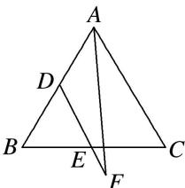

<!-- question-source:start -->
(4)(2016·天津)如图, 已知 $\triangle ABC$ 是边长为 1 的等边三角形, 点 $D$ , $E$ 分别是边 $AB$ , $BC$ 的中点, 连接 $DE$ 并延长到点 $F$ , 使得 $DE = 2EF$ , 则 $\overrightarrow{AF} \cdot \overrightarrow{BC}$ 的值为 ( )

A. $-\frac{5}{8}$ B. $\frac{1}{8}$ C. $\frac{1}{4}$ D. $\frac{11}{8}$
<!-- question-source:end -->

![[高中/总复习/专题/平面向量/专题2 平面向量的数量积-平面向量/考点01_求平面向量数量积/例题/answers/Q00045107A1.md]]
