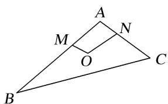

<!-- question-source:start -->
(5)(2018·天津)在如图的平面图形中，已知 $OM = 1$ ， $ON = 2$ ， $\angle MON = 120^{\circ}$ ， $\vec{BM} = 2\vec{MA}$ ， $\vec{CN} = 2\vec{NA}$ 则 $\vec{BC}\cdot \vec{OM}$ 的值为（）

A. -15 B. -9 C. -6 D. 0
<!-- question-source:end -->

![[高中/总复习/专题/平面向量/专题2 平面向量的数量积-平面向量/考点01_求平面向量数量积/例题/answers/Q00045108A1.md]]
