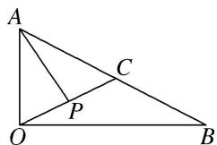

<!-- question-source:start -->
(8)如图， $\triangle AOB$ 为直角三角形， $OA=1, OB=2, C$ 为斜边 $AB$ 的中点， $P$ 为线段 $OC$ 的中点，则 $\overrightarrow{AP} \cdot \overrightarrow{OP} = (\quad)$ A. 1

B. $\frac{1}{16}$ C. $\frac{1}{4}$ D. $-\frac{1}{2}$

<!-- question-source:end -->

![[高中/总复习/专题/平面向量/专题2 平面向量的数量积-平面向量/考点01_求平面向量数量积/例题/answers/Q00045111A1.md]]
