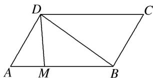

<!-- question-source:start -->
(9)如图，平行四边形ABCD中， $AB = 2$ ， $AD = 1$ ， $A = 60^{\circ}$ ，点 $M$ 在 $AB$ 边上，且 $AM = \frac{1}{3} AB$ ，则 $\overrightarrow{DM}\cdot \overrightarrow{DB}$ $=$ \_\_\_\_.

<!-- question-source:end -->

![[高中/总复习/专题/平面向量/专题2 平面向量的数量积-平面向量/考点01_求平面向量数量积/例题/answers/Q00045112A1.md]]
