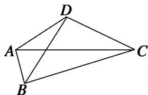

<!-- question-source:start -->
(10)如图所示，在平面四边形ABCD中，若AC=3，BD=2，则 $(\overrightarrow{AB}+\overrightarrow{DC})\cdot(\overrightarrow{AC}+\overrightarrow{BD})=$ \_\_\_\_。

<!-- question-source:end -->

![[高中/总复习/专题/平面向量/专题2 平面向量的数量积-平面向量/考点01_求平面向量数量积/例题/answers/Q00045113A1.md]]
