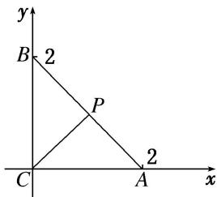

> [!faq]- 《专题2 平面向量的数量积-平面向量》例题解析
>
> > [!success]- **【答案】** 详见解析
>
> > [!note]- **【解析】**
> > 答案 4 解析 由题意可建立如图所示的坐标系. 可得 $A(2,0), B(0,2), P(1,1), C(0,0)$ , 则 $\overrightarrow{CP} \cdot \overrightarrow{CB} + \overrightarrow{CP} \cdot \overrightarrow{CA} = (1,1) \cdot (0,2) + (1,1) \cdot (2,0) = 2 + 2 = 4$ .
> >
> > 
