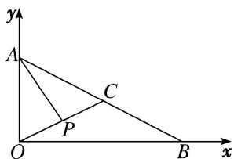

> [!faq]- 《专题2 平面向量的数量积-平面向量》例题解析
>
> > [!success]- **【答案】** B
>
> > [!note]- **【分析】**
> > 本题未单列分析。
>
> > [!note]- **【解析】**
> > 答案 B 解析 法一：因为 $\triangle AOB$ 为直角三角形， $OA = 1$ ， $OB = 2$ ， $C$ 为斜边 $AB$ 的中点，所以 $\overrightarrow{OC} = \frac{1}{2}\overrightarrow{OA} + \frac{1}{2}\overrightarrow{OB}$ ，所以 $\overrightarrow{OP} = \frac{1}{2}\overrightarrow{OC} = \frac{1}{4} (\overrightarrow{OA} + \overrightarrow{OB})$ ，则 $\overrightarrow{AP} = \overrightarrow{OP} - \overrightarrow{OA} = \frac{1}{4}\overrightarrow{OB} - \frac{3}{4}\overrightarrow{OA}$ ，所以 $\overrightarrow{AP} \cdot \overrightarrow{OP} = \frac{1}{4} (\overrightarrow{OB} - 3\overrightarrow{OA}) \cdot \frac{1}{4} (\overrightarrow{OA} + \overrightarrow{OB}) = \frac{1}{16} (\overrightarrow{OB^2} - 3\overrightarrow{OA^2}) = \frac{1}{16}$ .
> > 法二：以 O 为坐标原点， $\overrightarrow{OB}$ 的方向为 x 轴正方向， $\overrightarrow{OA}$ 的方向为 y 轴正方向建立平面直角坐标系(如图)，则 $A(0,1)$ ， $B(2,0)$ ， $C\left(1,\frac{1}{2}\right)$ ， $P\left(\frac{1}{2},\frac{1}{4}\right)$ ，所以 $\overrightarrow{OP}=\left(\frac{1}{2},\frac{1}{4}\right)$ ， $\overrightarrow{AP}=\left(\frac{1}{2},-\frac{3}{4}\right)$ ，故 $\overrightarrow{AP}\cdot\overrightarrow{OP}=\frac{1}{2}\times\frac{1}{2}-\frac{3}{4}\times\frac{1}{4}=\frac{1}{16}$ .
> > 
