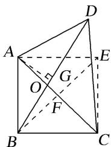

> [!faq]- 《专题2 平面向量的数量积-平面向量》例题解析
>
> > [!success]- **【答案】** A
>
> > [!note]- **【分析】**
> > 本题未单列分析。
>
> > [!note]- **【解析】**
> > 答案 C 解析 如图所示，四边形 $ABCE$ 是正方形， $F$ 为正方形的对角线的交点，易得 $AO < AF$ ，而 $\angle AFB = 90^\circ$ ， $\therefore \angle AOB$ 与 $\angle COD$ 为钝角， $\angle AOD$ 与 $\angle BOC$ 为锐角，根据题意， $I_1 - I_2 = \overrightarrow{OA} \cdot \overrightarrow{OB} - \overrightarrow{OB} \cdot \overrightarrow{OC} = \overrightarrow{OB} \cdot (\overrightarrow{OA} - \overrightarrow{OC}) = \overrightarrow{OB} \cdot \overrightarrow{CA} = |\overrightarrow{OB}| |\overrightarrow{CA}| \cdot \cos \angle AOB < 0, \therefore I_1 < I_2$ ，同理 $I_2 > I_3$ ，作 $AG \perp BD$ 于 $G$ ，又 $AB = AD, \therefore OB < BG = GD < OD$ ，而 $OA < AF = FC < OC, \therefore |\overrightarrow{OA}| |\overrightarrow{OB}| < |\overrightarrow{OC}| |\overrightarrow{OD}|$ ，而 $\cos \angle AOB = \cos \angle COD < 0, \therefore \overrightarrow{OA} \cdot \overrightarrow{OB} > \overrightarrow{OC} \cdot \overrightarrow{OD}$ ，即 $I_1 > I_3, \therefore I_3 < I_1 < I_2$ .
> >
> > 
