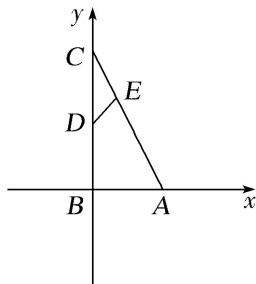

> [!faq]- 《专题2 平面向量的数量积-平面向量》例题解析
>
> > [!success]- **【答案】** 详见解析
>
> > [!note]- **【分析】**
> > 本题未单列分析。
>
> > [!note]- **【解析】**
> > 答案 $\frac{1}{3}$ 解析 如图，以 $B$ 为坐标原点， $AB$ 所在直线为 $x$ 轴， $BC$ 所在直线为 $y$ 轴，建立平面直角坐标系，则 $B(0,0), A(1,0), C(0,2)$ ，所以 $\overrightarrow{AC} = (-1,2)$ .
> >
> > 
> >
> > 因为 D 为 BC 的中点，所以 $D(0, 1)$ ，因为 $\overrightarrow{AE}=2\overrightarrow{EC}$ ，所以 $E\left(\frac{1}{3}, \frac{4}{3}\right)$ ，所以 $\overrightarrow{DE}=\left(\frac{1}{3}, \frac{1}{3}\right)$ ，所以 $\overrightarrow{DE}\cdot\overrightarrow{AC}=\left(\frac{1}{3}, \frac{1}{3}\right)\cdot(-1, 2)=-\frac{1}{3}+\frac{2}{3}=\frac{1}{3}$ .
