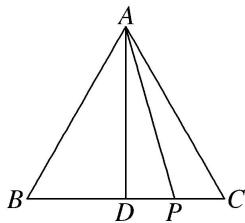

> [!faq]- 《专题2 平面向量的数量积-平面向量》例题解析
>
> > [!success]- **【答案】** 详见解析
>
> > [!note]- **【解析】**
> > 答案 6 解析 如图，设 BC 的中点为 D，则 $AD \perp BC$ ，∴ $|AP| \cos \angle PAD = AD$ ， $\overrightarrow{AB} + \overrightarrow{AC} = 2\overrightarrow{AD}$ 。∵ $\triangle ABC$ 是边长为 2 的等边三角形，∴ $AD = \sqrt{3}$ ，∴ $\overrightarrow{AP} \cdot (\overrightarrow{AB} + \overrightarrow{AC}) = \overrightarrow{AP} \cdot 2\overrightarrow{AD} = 2 \times |\overrightarrow{AD}| \times |\overrightarrow{AP}| \times \cos \angle PAD = 2|\overrightarrow{AD}|^{2} = 2 \times (\sqrt{3})^{2} = 6$ 。
> >
> > 
